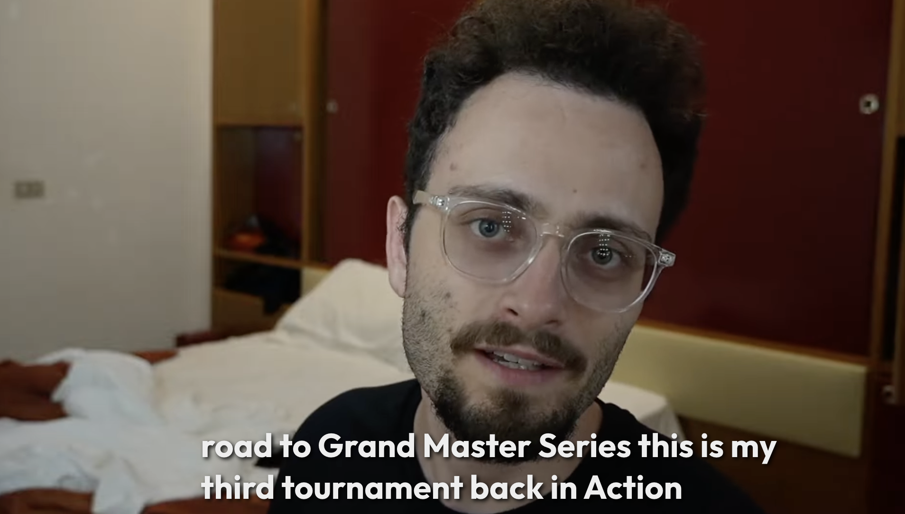
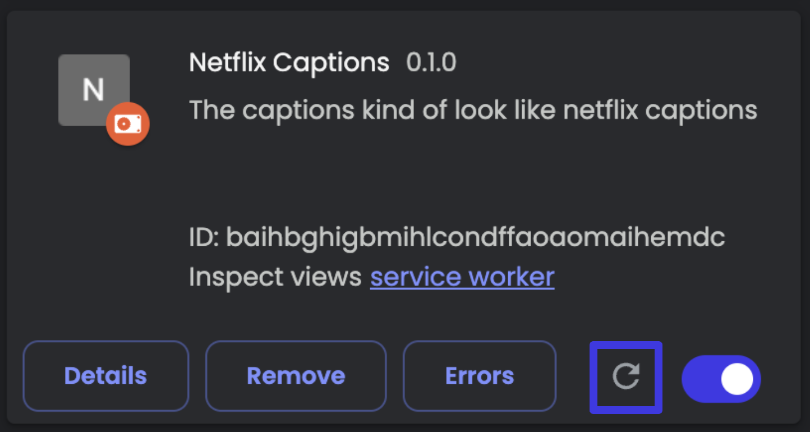

# This is an extension to let Youtube Captions look like Netflix Captions
# DEMO

## How to download

1. Git clone this repo (it's not on the webstore since publishing costs money)
2. Then, go to chrome://extensions/ and click "load unpacked"
3. Then, go to the path where you git cloned this and click "Select"
4. Turn on developer mode in google chrome (it's on the top right corner of chrome://extensions/)
5. Activate the extension and pin it 
6. Go to YouTube and click on the icon (to the right)   
    1. Make sure to turn it "ON" when captions are enabled

7. If it doesn't work, turn the extension off and on.
9. Have fun!

